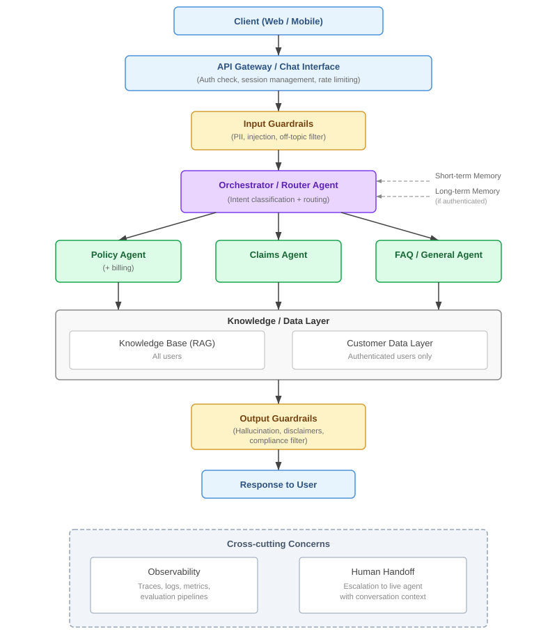

# Multi-Agent Insurance Chatbot: Design Document

## 1. Problem Statement

The goal is to design a multi-agent system that powers a customer-facing insurance chatbot. The system should:

- Answer customer queries about policies, claims, billing, and general insurance topics
- Support both **authenticated (logged-in)** and **anonymous (logged-out)** users
- Use short-term and long-term memory for personalized experiences
- Remain read-only, meaning no action-taking (filing claims, making payments, etc.)
- Handle edge cases well: off-topic queries, low-confidence answers, and compliance-sensitive responses

The design is tech-stack agnostic and should be implementable in any language or framework.

---

## 2. Why Multi-Agent?

A single monolithic LLM call could technically answer questions, but it creates problems:

- **Bloated system prompts** where one prompt tries to cover policy, claims, FAQ, and routing logic all at once
- **Poor specialization** since the model can't be tuned or optimized per domain
- **Difficult guardrails** because compliance rules differ between claims vs. general FAQ
- **No observability** since you can't tell which capability failed when things go wrong

A multi-agent architecture gives us separation of concerns, independent tunability, and clear failure boundaries. Each agent owns a well-defined slice of the problem, making it easier to debug, improve, and scale individual components.

---

## 3. System Architecture

### 3.1 High-Level Component Overview



### 3.2 Request Lifecycle

Here's how a user query flows through the system:

1. **Client** sends a message via the chat interface
2. **API Gateway** authenticates the request, creates or resumes a session
3. **Input Guardrails** scan the query for prompt injection, PII leakage, and off-topic content
4. **Orchestrator/Router Agent** receives the sanitized query along with:
   - Auth state (logged-in or anonymous)
   - Short-term memory (recent conversation context)
   - Long-term memory (if authenticated, includes past interactions and user profile summary)
5. Router **classifies intent** and **selects the specialist agent** (Policy, Claims, or FAQ)
6. **Specialist Agent** processes the query using:
   - Knowledge Base (RAG) for document-grounded answers
   - Customer Data Layer (if authenticated) for personalized answers
7. **Output Guardrails** validate the response for hallucinations, inject disclaimers, and apply compliance filters
8. **Response** is returned to the user
9. If at any point confidence is low or the user expresses frustration, **Human Handoff** is triggered

---

## 4. Component Deep Dives

### 4.1 Orchestrator / Router Agent

**Role:** The entry point for every query. It classifies user intent and routes to the appropriate specialist agent.

**How it works:**

- Takes the user query + conversation context (short-term memory) + user profile (long-term memory, if available)
- Classifies intent into categories: `policy`, `claims`, `billing`, `general/faq`, `action-request`, `out-of-scope`, `needs-human`
- Routes to the appropriate specialist agent
- If auth is required but the user is logged out, it responds with a prompt to log in (e.g., "I can look up your specific policy details if you log in")

**Auth-aware routing logic:**

| Intent | Logged Out | Logged In |
|--------|-----------|-----------|
| Generic policy question | FAQ Agent (generic KB) | Policy Agent (generic KB) |
| My policy details | Prompt to log in | Policy Agent (customer data) |
| Claims status | Prompt to log in | Claims Agent (customer data) |
| General insurance question | FAQ Agent | FAQ Agent |
| Action request (e.g., "cancel my policy") | Provide self-serve instructions + offer human handoff | Provide self-serve instructions + offer human handoff |
| Out-of-scope | Decline gracefully | Decline gracefully |
| Frustrated / confused | Human handoff | Human handoff |

**Handling action requests:**
Since this system is read-only, we need a clear strategy for when users ask us to *do* something ("cancel my policy", "file a claim", "update my address"). The router treats `action-request` as a first-class intent category. When detected, the system acknowledges what the user wants, provides step-by-step instructions or self-serve links to accomplish it, and offers human handoff if needed. This way the user is never stuck, even though the bot itself can't perform the action.

**Tradeoff: LLM-based routing vs. classifier model:**

- LLM-based routing is more flexible and understands nuance, but it's slower and costlier per request
- A trained classifier (e.g., fine-tuned small model) is faster and cheaper, but needs labeled training data and handles edge cases poorly
- My recommendation is to start with LLM-based routing since it's simpler to build and easier to iterate on. Once we have enough traffic data, we can move to a hybrid approach where a classifier handles common intents and the LLM handles ambiguous ones.

### 4.2 Specialist Agents

Each specialist agent has:

- A focused **system prompt** with domain-specific instructions
- Access to relevant **knowledge base** sections
- Access to **customer data** (if authenticated)
- A defined **scope boundary** so if a query falls outside its domain, it signals the router to re-route

#### Policy Agent (includes billing)

- Answers questions about coverage, terms, benefits, exclusions, premiums, billing cycles, and payment history
- Data sources: policy documents (RAG), customer policy records (authed)
- Key guardrail: must never state coverage exists or doesn't exist without grounding in the actual policy document

#### Claims Agent

- Answers questions about claims status, required documentation, the claims process, and timelines
- Data sources: claims process documentation (RAG), customer claims records (authed)
- Key guardrail: must not provide legal advice or make promises about claim outcomes

#### FAQ / General Agent

- Handles general insurance education, product comparisons, "how does insurance work" type questions, and finding a local agent
- Data sources: FAQ knowledge base, product pages (RAG only, no customer data needed)
- Lightest guardrail requirements since it doesn't deal with user-specific data

### 4.3 Knowledge and Data Layer

#### Knowledge Base (RAG)

This serves all agents with grounded, document-backed answers.

**Key design decisions:**

- **Chunking strategy:** I'd chunk by policy section and logical document boundaries rather than arbitrary token windows. Insurance documents have clear sections (e.g., "Coverage A: Dwelling", "Exclusions"), and these should be preserved as atomic retrieval units.
- **Metadata tagging:** Each chunk gets tagged with metadata like document type, product line, section, and effective date. This enables filtered retrieval so that an agent asking about "auto claims" doesn't pull back "homeowner's exclusions."
- **Retrieval:** Hybrid search combining semantic (vector similarity) with keyword (BM25) to handle both natural language queries and specific term lookups (e.g., policy numbers, coverage codes).

**Tradeoff: single vector store vs. per-agent stores:**

- A single store is simpler to maintain but agents may retrieve irrelevant cross-domain chunks
- Per-agent stores offer cleaner retrieval but add operational overhead
- I'd go with a single store with metadata filtering. It's simpler operationally, and metadata filters give us most of the isolation benefit without the overhead.

#### Customer Data Layer

- Accessed only for authenticated users
- Provides policy records, claims data, and billing information via internal APIs or database queries
- Important: raw data should not be exposed directly to the LLM. A data access service should format and filter the data before it reaches the agent (e.g., mask full account numbers, limit fields to what's relevant for the query)

### 4.4 Memory System

#### Short-term Memory (Within a Session)

**Approach:** Sliding window + summarization hybrid

- Keep the **last K turns** (e.g., 5-10) verbatim in the context window for recency and detail
- Everything before that gets **summarized into a running episode summary** that is prepended to the context
- The summary is updated every N turns or when the window slides
- Important: summarization happens **asynchronously** after the response is sent, so it never adds latency to the user-facing path

```text
Context passed to the agent:
┌──────────────────────────────────┐
│  Episode Summary                 │  <- compressed history
│  "User asked about auto policy   │
│   coverage, then billing cycle.  │
│   Has policy #AX-4421."         │
├──────────────────────────────────┤
│  Recent turns (verbatim)         │  <- last K turns, full detail
│  User: "What's my deductible?"  │
│  Bot: "Your deductible is..."   │
│  User: "Is that for collision?" │
└──────────────────────────────────┘
```

**Tradeoff:**

| Approach | Pros | Cons |
|----------|------|------|
| Full conversation buffer | Maximum accuracy | Hits token limits, expensive |
| Pure summarization | Token efficient | Lossy, may drop details user refers back to |
| **Sliding window + summary** | **Balances both** | **Slightly more complex to implement** |

#### Long-term Memory (Across Sessions, Logged-in Only)

**Approach:** Semantic memory store with user-scoped namespaces

- At the end of each session (or periodically), we persist:
  - **Conversation summary** of what was discussed, what was resolved, and what's pending
  - **User profile context** with extracted facts (e.g., "has 2 auto policies", "asked about roof damage claim 3 times")
  - **Unresolved issues** that the bot couldn't answer or that need follow-up
- Stored in a **vector database** with user-scoped namespaces so each user's memories are isolated
- On new session start, we retrieve relevant long-term memories based on the new query's semantic similarity

**Why a vector DB for long-term memory:**
User references to past interactions are inherently semantic ("what did we discuss last time about my claim?"). Keyword search fails here. Vector similarity finds relevant past context even when the phrasing is completely different.

**Risk: stale or irrelevant memory retrieval.**
Long-term memory can hurt if it pulls in outdated or unrelated past context. To mitigate this, we apply a relevance score threshold (discard memories below a similarity cutoff) and weight results by recency so that recent interactions rank higher than older ones.

This can be implemented using solutions like Mem0, [MemoMesh](https://github.com/biku1998/memo-mesh) (an open-source memory layer for AI agents that I've been building in this problem space), or a custom implementation backed by any vector database (Pinecone, Qdrant, Weaviate, pgvector, etc.).

### 4.5 Guardrails

#### Input Guardrails (Pre-processing)

Applied before the query reaches the router:

| Check | Purpose | Action |
|-------|---------|--------|
| Prompt injection detection | Prevent adversarial manipulation of agent behavior | Block + log, return generic "I can't process that" |
| PII detection | Prevent users from pasting sensitive data (SSN, credit card) into chat | Redact PII before forwarding, warn user |
| Off-topic filter | Detect clearly non-insurance queries | Polite decline: "I'm here to help with insurance questions" |
| Input length / rate limiting | Prevent abuse | Reject at gateway level |

#### Output Guardrails (Post-processing)

Applied after the specialist agent generates a response, before returning to the user:

| Check | Purpose | Action |
|-------|---------|--------|
| Grounding / hallucination check | Ensure claims about coverage, terms, or status are backed by retrieved data | If response references specifics not found in retrieved context, flag or remove |
| Disclaimer injection | Add legal/compliance disclaimers where needed | Append: "This is for informational purposes only. Please refer to your policy document for exact terms." |
| Compliance filter | Block responses that could be construed as legal, medical, or financial advice | Rephrase or add caveats |
| Tone check | Ensure response is professional and empathetic | Rewrite if flagged |

**Tradeoff: guardrails as separate LLM call vs. rule-based:**

- LLM-based guardrails are more flexible and catch nuanced issues, but they add latency and cost
- Rule-based guardrails (regex, keyword matching) are fast and cheap, but brittle
- My approach: use rule-based for input guardrails (injection patterns and PII patterns are well-defined, and speed matters at this stage). Use LLM-based for output guardrails since hallucination and compliance checks require understanding context.

### 4.6 Human Handoff

**Triggers:**

- Agent confidence score below a defined threshold (e.g., retrieval similarity score too low)
- User explicitly asks for a human ("let me talk to someone")
- Sentiment detection picks up frustration, anger, or the user repeating the same question
- Query involves sensitive topics (complaints, legal disputes, claim denials)

**Handoff flow:**

1. System informs the user: "Let me connect you with a specialist who can help"
2. The conversation summary and context are passed to the human agent (not raw LLM internals)
3. The request gets routed to the appropriate human queue (claims team, billing team, general support)

No chatbot should be a dead-end. Having a clear escalation path is essential for a production system.

---

## 5. Latency and Cost Considerations

A multi-agent system introduces multi-hop latency. A single user query can trigger 2-4 LLM calls (router classification, specialist agent generation, output guardrail check, and occasionally a summarization call). This is the biggest practical tradeoff of multi-agent vs. single-agent.

**Rough latency breakdown for a typical authenticated query:**

| Step | Estimated Latency |
|------|-------------------|
| Input guardrails (rule-based) | ~10-20ms |
| Router classification (LLM) | ~150-300ms |
| RAG retrieval (vector search + reranking) | ~100-200ms |
| Customer data fetch (API call) | ~50-100ms |
| Specialist agent generation (LLM) | ~500-1500ms |
| Output guardrails (LLM) | ~200-400ms |
| **Total** | **~1-2.5s** |

**Strategies to keep latency acceptable:**

- **Streaming responses:** Start streaming the specialist agent's response to the user while output guardrails run in parallel on the stream. This makes the perceived latency much lower than the actual end-to-end time.
- **Parallel retrieval:** RAG retrieval and customer data fetch are independent. Run them concurrently rather than sequentially.
- **Cache common queries:** Many insurance questions are repeated across users ("what does comprehensive coverage mean?", "how do I file a claim?"). A semantic cache that matches against recently answered queries can skip the full pipeline entirely for these.
- **Router optimization:** As mentioned earlier, moving high-confidence intent classification to a lightweight classifier reduces the router step from ~200ms to ~10ms for common intents.

**Cost:** Each LLM call costs tokens. With 2-3 LLM calls per query, cost per conversation adds up. Caching, classifier-based routing, and choosing the right model size per component (a smaller model for the router, a more capable one for specialist agents) are the main levers.

---

## 6. Observability

Observability is how we debug, improve, and build trust in a multi-agent system. In this kind of setup, a single user query passes through multiple components. Without proper tracing, diagnosing failures becomes nearly impossible.

### 6.1 What We Observe

#### Traces (Per-request lifecycle)

Every request gets a **trace ID** that follows it through the entire pipeline:

```text
Trace: req_abc123
├── Gateway: auth check (2ms)
├── Input Guardrails: passed (15ms)
├── Router Agent: intent=claims, confidence=0.92 (180ms)
├── Claims Agent:
│   ├── RAG Retrieval: 4 chunks, top score=0.87 (120ms)
│   ├── Customer Data Fetch: claims record #CL-9921 (45ms)
│   └── LLM Generation: 312 tokens (850ms)
├── Output Guardrails: passed, disclaimer added (200ms)
└── Total latency: 1412ms
```

This tells us exactly where time is spent, where failures happen, and which agent handled the query.

#### Metrics

| Metric | Why it matters |
|--------|---------------|
| **Latency per component** (p50, p95, p99) | Identifies bottlenecks. Is the LLM slow, or is retrieval slow? |
| **Routing accuracy** | Are queries going to the right agent? We track re-routes and fallbacks to measure this |
| **Retrieval quality** | Top-k similarity scores tell us if we're retrieving relevant chunks |
| **Guardrail trigger rates** | How often are input/output guardrails firing? High rates may indicate upstream issues |
| **Human handoff rate** | Too high means the bot isn't doing its job. Too low might mean it's being overconfident |
| **User satisfaction signals** | Thumbs up/down, repeat questions (implicit dissatisfaction), session length |
| **Token usage per request** | Cost tracking, broken down per agent and in total |

#### Logs

- Every agent decision (intent classification, confidence score, selected data sources)
- Guardrail activations with the triggering content (redacted of PII)
- Memory operations (what was stored, what was retrieved, and relevance scores)

### 6.2 Approach

I'd use a **tracing-first** observability platform. For LLM-based systems, tools like **Arize AI**, **LangSmith**, **Langfuse**, or **Phoenix** provide purpose-built observability that standard APM tools (Datadog, New Relic) don't cover well. Specifically, they offer:

- LLM input/output logging with token counts
- Retrieval quality metrics (relevance scoring, chunk attribution)
- Prompt version tracking (which system prompt version produced a given response)
- Evaluation pipelines (automated quality checks on a sample of responses)

**Tradeoff: build vs. buy:**

- Building custom observability is expensive and distracts from the core product
- LLM observability platforms like Arize or Langfuse give you roughly 80% of what you need out of the box
- I'd go with an LLM observability platform for tracing and evaluation, and supplement it with standard infrastructure monitoring for API latency, error rates, and uptime.

### 6.3 Feedback Loop

Observability data feeds directly into system improvement:

```text
Observe -> Identify low-quality responses -> Analyze traces
    -> Fix: improve prompts, add KB content, tune retrieval, adjust guardrails
        -> Deploy -> Observe again
```

This creates a continuous improvement cycle rather than a "deploy and hope" approach.

---

## 7. Evaluation Strategy

Before shipping this system (and on every prompt/retrieval change after), we need a way to measure whether responses are actually good. Observability tells us *what* is happening; evaluation tells us *how well* it's working.

**Golden test set:**
I'd curate a dataset of 50-100 question/expected-answer pairs across all agent domains (policy, claims, FAQ) and both user states (logged-in, logged-out). This set covers common queries, edge cases (action requests, out-of-scope), and compliance-sensitive questions. Every change to prompts, retrieval config, or guardrails gets run against this set before deployment.

**LLM-as-judge for open-ended quality:**
Not every response has a single "correct" answer. For open-ended or conversational responses, I'd use an LLM-as-judge approach where a separate model scores responses on:

- **Correctness:** Is the answer factually grounded in the retrieved context?
- **Completeness:** Did it address what the user actually asked?
- **Tone:** Is it professional, empathetic, and appropriate for insurance?
- **Guardrail compliance:** Does it include disclaimers where needed? Does it avoid giving advice?

**When to run evals:**

- On every prompt or retrieval configuration change (automated in CI)
- Weekly on a sample of production traffic (to catch drift)
- After any knowledge base update (new policy documents, updated FAQs)

This isn't heavyweight, but it gives us a safety net against regressions and a baseline to measure improvement over time.

---

## 8. Logged-in vs. Logged-out: Unified Architecture

Rather than building two separate systems, I'm using a single architecture with an auth-aware router that adjusts behavior based on user state.

| Capability | Logged Out | Logged In |
|-----------|-----------|-----------|
| FAQ / general questions | Yes | Yes |
| Generic policy info | Yes | Yes |
| Personalized policy answers | No (prompt to log in) | Yes |
| Claims status | No (prompt to log in) | Yes |
| Billing details | No (prompt to log in) | Yes |
| Short-term memory | Yes (session only) | Yes (session only) |
| Long-term memory | No | Yes (cross-session) |
| Human handoff | Yes | Yes (with full context) |

This avoids duplication while ensuring logged-out users still get value and are nudged toward logging in for personalized help.

---

## 9. Key Tradeoffs Summary

| Decision | Option A | Option B | My Choice | Rationale |
|----------|----------|----------|-----------|-----------|
| Routing approach | LLM-based | Trained classifier | LLM-based initially, hybrid later | Faster to build and iterate. Move to hybrid once we have traffic data |
| Memory strategy | Full buffer | Pure summary | Sliding window + summary hybrid | Balances accuracy and token efficiency |
| RAG store topology | Per-agent stores | Single shared store | Single store + metadata filtering | Simpler ops, metadata filters provide sufficient isolation |
| Input guardrails | LLM-based | Rule-based | Rule-based | Injection/PII patterns are well-defined; speed matters at this stage |
| Output guardrails | LLM-based | Rule-based | LLM-based | Compliance/hallucination checks need contextual understanding |
| Observability | Build custom | Use platform | LLM observability platform | Platforms give 80% of the value; focus engineering effort on the core product |
| Auth handling | Two separate systems | Single auth-aware system | Single auth-aware system | Less duplication, simpler to maintain |
| Latency management | Accept multi-hop cost | Optimize aggressively | Streaming + parallel retrieval + caching | Best perceived latency without over-engineering |

---

## 10. Failure Modes and Mitigations

| Failure | Impact | Mitigation |
|---------|--------|------------|
| LLM hallucination about coverage | High: user acts on wrong info | Output guardrails + grounding check + disclaimers |
| Router misclassifies intent | Medium: wrong agent responds | Agents detect out-of-scope queries and signal re-route |
| RAG retrieves irrelevant chunks | Medium: inaccurate response | Metadata filtering + relevance threshold cutoff |
| Customer data service is down | High: can't answer personalized queries | Graceful degradation: fall back to generic answers + inform user |
| LLM provider outage | Critical: full outage | Canned responses for common queries as fallback + human handoff |
| Memory store corruption/loss | Low: degraded personalization | Memory is supplementary, not on the critical path. System works without it |
| Stale/irrelevant long-term memory | Medium: confuses current response with old context | Relevance score threshold + recency weighting on retrieval |

---

## 11. Future Considerations (Out of Scope)

These are intentionally excluded from the current design but worth noting:

- **Action-taking agents** for filing claims, making payments, updating policy details
- **Multi-language support** for serving non-English speaking customers
- **Voice channel** to extend the chatbot to phone/IVR systems
- **A/B testing framework** for testing different prompts, agent configurations, and retrieval strategies
- **Fine-tuned models** to replace general-purpose LLMs with insurance-domain specific models for specialist agents

---

## 12. Summary

This design provides a pragmatic multi-agent architecture that:

- Decomposes into 4 agents (router + 3 specialists) with clear boundaries
- Handles both authenticated and anonymous users through a unified, auth-aware routing system
- Manages memory with a hybrid short-term strategy and semantic long-term store
- Prioritizes safety with layered guardrails (input + output) appropriate for the insurance domain
- Addresses latency head-on with streaming, parallel retrieval, and caching strategies
- Enables continuous improvement through comprehensive observability, evaluation, and feedback loops
- Degrades gracefully with human handoff as the ultimate fallback

The architecture is tech-stack agnostic and can be implemented with any LLM provider, vector database, and programming language. The core value is in the separation of concerns: each component has a clear responsibility, a defined interface, and can be independently improved or replaced.
